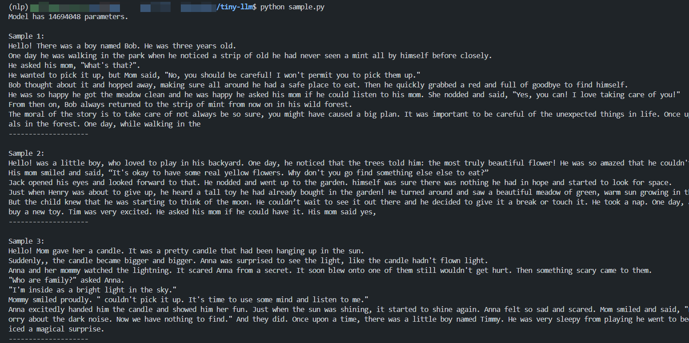

# Tiny-LLM

此项目在于实现一个简单的大语言模型，从训练tokenizer开始，到训练模型，再到使用模型生成文本。仅使用Numpy和Python即可实现一个简单的大语言模型训练，显存使用2G左右。以下为项目效果展示。



## Step 1: 训练Tokenizer

首先，我们需要训练一个Tokenizer，Tokenizer的作用是将文本转换为数字序列。我们使用的数据集是 [TinyStory](https://www.modelscope.cn/datasets/AI-ModelScope/TinyStories) ，一个小型的故事集合，TinyStory 包含由GPT-3.5和GPT-4合成生成的短篇故事数据集，这些故事仅使用有限词汇。Tokenizer的作用是将文本转换为数字序列，我们使用的Tokenizer是一个简单的字符级Tokenizer，即将文本中的字符映射为数字。使用以下命令即可下载数据集并训练Tokenizer。

```bash
python train_tokenizer.py --download True --vocab_size 32000
```

llama2的词表大小为32000，那我们这里也设置为32000，与llama2保持一致。
