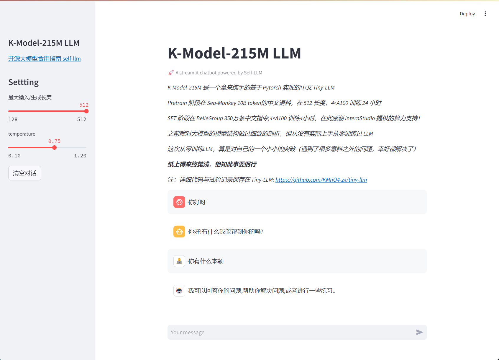
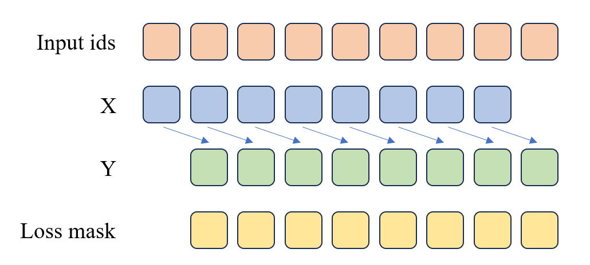
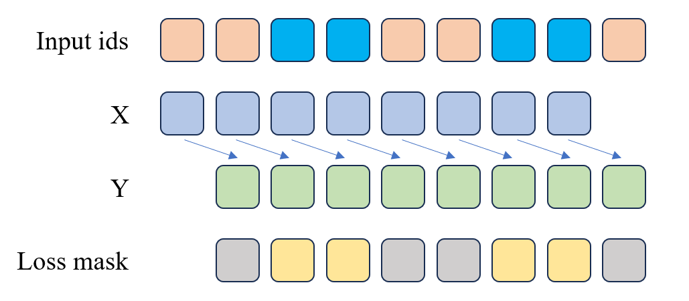
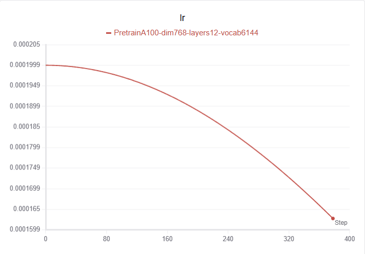

# Tiny-LLM

<div align="center">
  
</div>

## 🚀 项目概述

**Tiny-LLM** 是一个完整的中文小型大语言模型训练框架，基于 PyTorch 从零实现。本项目提供了从数据处理、模型训练到部署的完整流程，帮助您理解和实践大语言模型的训练过程。

**K-Model-215M** 是使用本框架训练的 215M 参数中文语言模型，具备良好的中文理解和生成能力。

## ✨ 这个仓库可以做什么？

### 🎯 核心功能
- **🔧 完整的 LLM 训练流程**：从数据预处理到模型部署的端到端解决方案
- **🤖 中文语言模型**：专门针对中文优化的 215M 参数模型
- **💬 智能对话系统**：支持多轮对话的 Web 聊天界面
- **📊 自定义模型训练**：可根据需求训练不同规模和用途的模型

### 🛠️ 技术特性
- **自定义 Tokenizer**：基于 BPE 算法的中文分词器（词表大小 6144）
- **灵活的模型架构**：支持不同层数、头数和隐藏层维度的配置
- **高效训练流程**：支持预训练和有监督微调两个阶段
- **多种数据集格式**：支持预训练和对话数据集的处理
- **实时训练监控**：集成 SwanLab 进行训练过程可视化

### 📈 训练规模
- **预训练阶段**：10B tokens 中文语料（Seq-Monkey），512 序列长度，4×A100 训练 24 小时
- **SFT 阶段**：350万条中文指令（BelleGroup），4×A100 训练 4 小时
- **模型参数**：215M 参数量，适合资源有限的环境

### 🎨 应用场景
- **🔬 研究学习**：理解大语言模型的训练原理和实现细节
- **🏗️ 模型开发**：快速构建和测试自定义的中文语言模型
- **💡 教学实验**：为 AI 教育提供完整的实践案例
- **🚀 产品原型**：为中文 NLP 应用提供基础模型

## 💻 在线体验

- **ModelScope 模型**：https://www.modelscope.cn/models/kmno4zx/K-Model-215M
- **ModelScope 创空间**：https://www.modelscope.cn/studios/kmno4zx/K-Model-215M

## 🔮 作者的话

> *其实我很久之前就想要动手使用 torch 实现一个小型的 LLM，但是碍于一直没有大片空闲的时间。趁着过年在家整好手头有一些算力资源，就动手尝试训练了一下。我会在下面简单记录我的实验过程，也会对代码做详细的介绍和注释。如有纰漏，还请见谅~*

*之前就对大模型的模型结构做过细致的剖析，但从没有实际上手从零训练过 LLM*

*这次从零训练LLM，算是对自己的一个小小的突破（遇到了很多意料之外的问题，幸好都解决了）*

***纸上得来终觉浅，绝知此事要躬行***

## 🚀 快速开始

### 📋 环境准备

```bash
# 1. 确保已安装 CUDA 和 PyTorch
# 2. 克隆仓库
git clone https://github.com/KMnO4-zx/tiny-llm.git
cd tiny-llm

# 3. 安装依赖
pip install -r requirements.txt
```

### 🎯 使用方式

#### 方式一：直接使用预训练模型

```bash
# 启动 Web 对话界面
streamlit run web_demo.py
```

#### 方式二：从零开始训练

```bash
# 1. 数据准备
python dataset_download.py

# 2. 训练 Tokenizer（可选，已提供训练好的 tokenizer_k）
python train_tokenizer.py

# 3. 预训练阶段
python pretrain.py

# 4. 有监督微调（SFT）
python sft_full.py

# 5. 模型导出
python export_model.py
```

### 📁 文件结构

```
tiny-llm/
├── README.md                 # 项目说明
├── requirements.txt          # 依赖包
├── k_model.py               # 模型定义
├── dataset.py               # 数据集处理
├── train_tokenizer.py       # 训练分词器
├── pretrain.py              # 预训练脚本
├── sft_full.py              # 有监督微调脚本
├── export_model.py          # 模型导出
├── web_demo.py              # Web 演示界面
├── dataset_download.py      # 数据集下载
├── sample.py                # 模型推理示例
└── tokenizer_k/             # 预训练分词器
```


## 🔧 技术实现详解

### 01 Tokenizer

在自然语言处理 (NLP) 中，Tokenizer 是一种将文本分解为较小单位（称为 token）的工具。这些 token 可以是词、子词、字符，甚至是特定的符号。Tokenization 是 NLP 中的第一步，直接影响后续处理和分析的效果。不同类型的 tokenizer 适用于不同的应用场景，以下是几种常见的 tokenizer 及其特点。

**BPE**(Byte Pair Encoding)是一种基于统计方法，通过反复合并频率最高的字符或字符序列对来生成子词词典。这种方法的优点在于其简单和高效，能够有效地处理未知词和罕见词，同时保持较低的词典大小。BPE 的合并过程是自底向上的，逐步将频率最高的字符对合并成新的子词，直到达到预定的词典大小或不再有高频的字符对。

示例：
```
Input: "lower"
Output: ["low", "er"]

Input: "newest"
Output: ["new", "est"]
```

在这个例子中，单词“lower”被分割成子词“low”和“er”，而“newest”被分割成“new”和“est”。这种方法有效地处理了词干和词缀，保持了单词的基本语义结构。

那我们本次就是用 BPE Tokenizer 来进行 Tokenization。那首先就需要创建一些配置文件，来配置我们的 Tokenizer。包括 `tokenizer_config.json` 和 `special_tokens_map.json`，以及 chat_template，这个 chat_template 是用来配置我们的对话模板的。

```python
def create_tokenizer_config(save_dir: str) -> None:
    """创建完整的tokenizer配置文件"""
    config = {
        "add_bos_token": False,
        "add_eos_token": False,
        "add_prefix_space": True,
        "bos_token": "<|im_start|>",
        "eos_token": "<|im_end|>",
        "pad_token": "<|im_end|>",
        "unk_token": "<unk>",
        "model_max_length": 1000000000000000019884624838656,
        "clean_up_tokenization_spaces": False,
        "tokenizer_class": "PreTrainedTokenizerFast",
        "chat_template": (
            ""
            ""
            "<|im_start|>system\n{{ message['content'] }}<|im_end|>\n"
            ""
            "<|im_start|>user\n{{ message['content'] }}<|im_end|>\n"
            ""
            "<|im_start|>assistant\n{{ message['content'] }}<|im_end|>\n"
            ""
            ""
            ""
            "{{ '<|im_start|>assistant\n' }}"
            ""
        )
    }

    # 保存主配置文件
    with open(os.path.join(save_dir, "tokenizer_config.json"), "w", encoding="utf-8") as f:
        json.dump(config, f, ensure_ascii=False, indent=4)

    # 创建special_tokens_map.json
    special_tokens_map = {
        "bos_token": "<|im_start|>",
        "eos_token": "<|im_end|>",
        "unk_token": "<unk>",
        "pad_token": "<|im_end|>",
        "additional_special_tokens": ["<s>", "</s>"]
    }
    with open(os.path.join(save_dir, "special_tokens_map.json"), "w", encoding="utf-8") as f:
        json.dump(special_tokens_map, f, ensure_ascii=False, indent=4)
```

然后就可以开始开心的训练了，详细的代码可以查看本仓库目录下的 [`train_tokenizer.py`](./train_tokenizer.py) 文件。

### 02 Dataset

### Pretrain Dataset

Pretrain Dataset 其实很好理解，在模型的 Pretrain阶段主要是为了让模型学习到语言的一些基本规律，也就是知识学习阶段。模型在这个阶段需要学会如何利用前面的 `token` 来预测下一个 `token`。

```python
class SkyWorkPretrainDataset(Dataset):
    def __init__(self, data_path, tokenizer, max_length=512):
        super().__init__()
        self.data_path = data_path
        self.tokenizer = tokenizer
        self.max_length = max_length
        self.padding = 0
        with open(data_path, 'r', encoding='utf-8') as f:
            self.data = f.readlines()

    def __len__(self):
        return len(self.data)

    def __getitem__(self, index: int):
        sample = json.loads(self.data[index])
        text = f"{self.tokenizer.bos_token}{sample['text']}"
        input_id = self.tokenizer(text).data['input_ids'][:self.max_length]
        text_len = len(input_id)
        # 没满最大长度的剩余部分
        padding_len = self.max_length - text_len
        input_id = input_id + [self.padding] * padding_len
        # 0表示不计算损失
        loss_mask = [1] * text_len + [0] * padding_len

        input_id = np.array(input_id)
        X = np.array(input_id[:-1]).astype(np.int64)
        Y = np.array(input_id[1:]).astype(np.int64)
        loss_mask = np.array(loss_mask[1:]).astype(np.int64)
        return torch.from_numpy(X), torch.from_numpy(Y), torch.from_numpy(loss_mask)
        
```

在以上代码可以看出，我们的 `Pretrain Dataset` 主要是将 `text` 通过 `tokenizer` 转换成 `input_id`，然后将 `input_id` 拆分成 `X` 和 `Y`，其中 `X` 为 `input_id` 的前 `n-1` 个元素，`Y` 为 `input_id` 的后 `n-1` 个元素。`loss_mask` 主要是用来标记哪些位置需要计算损失，哪些位置不需要计算损失。如果你不太能明白，可以看下面的示意图。

<div align="center">
  
</div>

图中的 Input ids 就是经过 tokenizer 转换后的 `input_id`，其中 `X` 就是 `input_id` 的前 `n-1` 个元素，`Y` 就是 `Input ids` 的后 `n-1` 个元素。`Loss Mask` 就是标记哪些位置需要计算损失，当然在 Pretrain 阶段是要对所有的 Y 都计算损失的。

### SFT Dataset

> 注：详细代码可以查看本仓库目录下的 [`dataset.py`](dataset.py) 文件。

SFT Dataset 其实是一个多轮对话数据集，我们的目标是让模型学会如何进行多轮对话。在这个阶段我们的输入是上一轮的对话内容，输出是当前轮的对话内容。

```python
class SFTDataset(Dataset):
    def __init__(self, data_path, tokenizer, max_length=512):
        super().__init__()
        self.data_path = data_path
        self.tokenizer = tokenizer
        self.max_length = max_length
        self.padding = 0
        with open(data_path, 'r', encoding='utf-8') as f:
            self.data = f.readlines()

    def __len__(self):
        return len(self.data)

    def generate_loss_mask(self, input_ids):
        # 生成 loss mask, 0 表示不计算损失, 1 表示计算损失
        mask = [0] * len(input_ids)
        a_sequence = [3, 1074, 537, 500, 203]  # <|im_start|>assistant\n
        a_length = len(a_sequence)
        n = len(input_ids)
        i = 0
        
        while i <= n - a_length:
            # 检查当前位置是否匹配目标子序列
            match = True
            for k in range(a_length):
                if input_ids[i + k] != a_sequence[k]:
                    match = False
                    break
            if match:
                # 从子序列结束的位置开始查找第一个4
                j = None
                for idx in range(i + a_length, n):
                    if input_ids[idx] == 4:
                        j = idx
                        break
                if j is not None:
                    start = i + a_length
                    end = j  # 结束位置设为j（包含4）
                    # 标记区间为1（包括start到end）
                    if start <= end:
                        for pos in range(start, end + 1):
                            if pos < len(mask):
                                mask[pos] = 1
                # 跳过当前子序列，避免重叠匹配
                i += a_length
            else:
                i += 1
        return mask

    def __getitem__(self, index: int):
        sample = json.loads(self.data[index])
        text = self.tokenizer.apply_chat_template(sample, tokenize=False, add_generation_prompt=False)
        input_id = self.tokenizer(text).data['input_ids'][:self.max_length]
        text_len = len(input_id)
        # 没满最大长度的剩余部分
        padding_len = self.max_length - text_len
        input_id = input_id + [self.padding] * padding_len
        # 0表示不计算损失
        loss_mask = self.generate_loss_mask(input_id)

        input_id = np.array(input_id)
        X = np.array(input_id[:-1]).astype(np.int64)
        Y = np.array(input_id[1:]).astype(np.int64)
        loss_mask = np.array(loss_mask[1:]).astype(np.int64)
        return torch.from_numpy(X), torch.from_numpy(Y), torch.from_numpy(loss_mask)
```

在 SFT 阶段，我这里使用的是多轮对话数据集，所以就需要区分哪些位置需要计算损失，哪些位置不需要计算损失。在上面的代码中，我使用了一个 `generate_loss_mask` 函数来生成 `loss_mask`。这个函数主要是用来生成 `loss_mask`，其中 `loss_mask` 的生成规则是：当遇到 `|<im_start|>assistant\n` 时，就开始计算损失，直到遇到 `|<im_end|>` 为止。这样就可以保证我们的模型在 SFT 阶段只计算当前轮的对话内容。那我也给出一个示意图，帮助大家理解。

<div align="center">
  
</div>

可以看到，其实 SFT Dataset 和 Pretrain Dataset 的 `X` 和 `Y` 是一样的，只是在 SFT Dataset 中我们需要生成一个 `loss_mask` 来标记哪些位置需要计算损失，哪些位置不需要计算损失。 图中 `Input ids` 中的蓝色小方格就是AI的回答，所以是需要模型学习的地方。所以在 `loss_mask` 中，蓝色小方格对应的位置是黄色，其他位置是灰色。在代码 `loss_mask` 中的 1 对应的位置计算损失，0 对应的位置不计算损失。

### 03 Model

首先是 [ModelConfig](k_model.py)，这个如果后续想要导出为 transformers 可以加载的模型，就需要定义一个 `ModelConfig` 类，且需要继承 `transformers.PretrainedConfig`。

```python
class ModelConfig(PretrainedConfig):
    model_type = "Tiny-K"
    def __init__(
            self,
            dim: int = 768,
            n_layers: int = 12,
            n_heads: int = 16,
            n_kv_heads: int = 8,
            vocab_size: int = 6144,
            hidden_dim: int = None,
            multiple_of: int = 64,
            norm_eps: float = 1e-5,
            max_seq_len: int = 512,
            dropout: float = 0.0,
            flash_attn: bool = True,
            **kwargs,
    ):
        self.dim = dim
        self.n_layers = n_layers
        self.n_heads = n_heads
        self.n_kv_heads = n_kv_heads
        self.vocab_size = vocab_size
        self.hidden_dim = hidden_dim
        self.multiple_of = multiple_of
        self.norm_eps = norm_eps
        self.max_seq_len = max_seq_len
        self.dropout = dropout
        self.flash_attn = flash_attn
        super().__init__(**kwargs)
```

模型部分不会过多赘述，代码里面已经做了很详细的注释。这里只是简单的介绍一下模型的结构。想要详细了解模型的结构，可以查看本仓库目录下的 [`k_model.py`](k_model.py) 文件。

### 04 Training

终于到训练环节啦！

首先此次 Pretrain 阶段使用了余弦退火学习率调度器，代码如下：

> 注：代码参考自 llama2.c 仓库。

```python
def get_lr(it, all):
    """
    根据当前的训练迭代步数 it 返回当前的学习率值。
    学习率调整策略包括线性预热、余弦退火和最小学习率限制。
    """
    warmup_iters = args.warmup_iters
    lr_decay_iters = all
    min_lr = args.learning_rate / 10

    # 1) 线性预热阶段，在 warmup_iters 之前，学习率线性增加到目标学习率
    if it < warmup_iters:
        return args.learning_rate * it / warmup_iters
    
    # 2) 如果迭代步数超过 lr_decay_iters，返回最小学习率 min_lr
    if it > lr_decay_iters:
        return min_lr
    
    # 3) 余弦退火阶段，在 warmup_iters 和 lr_decay_iters 之间，学习率逐渐降低
    decay_ratio = (it - warmup_iters) / (lr_decay_iters - warmup_iters)
    assert 0 <= decay_ratio <= 1 # 确保衰减比在合法范围内
    coeff = 0.5 * (1.0 + math.cos(math.pi * decay_ratio)) # 余弦函数计算衰减系数，范围为0到1
    return min_lr + coeff * (args.learning_rate - min_lr) # 根据衰减系数调整学习率
```

我们可以来看一下学习率的整体趋势，如下图所示：

<div align="center">
  
</div>

可以看到，学习率本应该在预热阶段是线性增加的，但我设置的 `warmup_iters=0`，哈哈哈。然后在余弦退火阶段逐渐降低，最后到达最小学习率。

OK，训练代码由于我只有单卡，所以也没有写 DDP 多卡并行（我真的很想尝试一下，有没有大佬施舍一点~）。Pretrain 和 SFT Train 的训练代码基本一样，只是 Dataset 形式不同，所以我就只展示 Pretrain 阶段的训练代码。

> 注：详细代码可以查看本仓库目录下的 [`pretrain.py`](./pretrain.py) 和 [`sft_full`](sft_full.py) 文件。

```python
def train_epoch(epoch):
    start_time = time.time()
    for step, (X, Y, loss_mask) in enumerate(train_loader):
        X = X.to(args.device)
        Y = Y.to(args.device)
        loss_mask = loss_mask.to(args.device)

        lr = get_lr(epoch * iter_per_epoch + step, args.epochs * iter_per_epoch)
        for param_group in optimizer.param_groups:
            param_group['lr'] = lr

        with ctx:
            out = model(X, Y)
            loss = out.last_loss / args.accumulation_steps
            loss_mask = loss_mask.view(-1)
            loss = torch.sum(loss * loss_mask) / loss_mask.sum()

        scaler.scale(loss).backward()

        if (step + 1) % args.accumulation_steps == 0:
            scaler.unscale_(optimizer)
            torch.nn.utils.clip_grad_norm_(model.parameters(), args.grad_clip)

            scaler.step(optimizer)
            scaler.update()

            optimizer.zero_grad(set_to_none=True)

        if step % args.log_interval == 0:
            spend_time = time.time() - start_time
            Logger(
                'Epoch:[{}/{}]({}/{}) loss:{:.3f} lr:{:.7f} epoch_Time:{}min:'.format(
                    epoch + 1,
                    args.epochs,
                    step,
                    iter_per_epoch,
                    loss.item() * args.accumulation_steps,
                    optimizer.param_groups[-1]['lr'],
                    spend_time / (step + 1) * iter_per_epoch // 60 - spend_time // 60))
            if args.use_swanlab:
                swanlab.log({
                    "loss": loss.item() * args.accumulation_steps,
                    "lr": optimizer.param_groups[-1]['lr']
                })

        if (step + 1) % args.save_interval == 0:
            model.eval()
            ckp = f'{args.save_dir}/SkyWork_pretrain_{lm_config.dim}_{lm_config.n_layers}_{lm_config.vocab_size}.pth'

            state_dict = model.state_dict()
            torch.save(state_dict, ckp)
            model.train()
        
        if (step + 1) % 20000 == 0:
            model.eval()
            ckp = f'{args.save_dir}/SkyWork_pretrain_{lm_config.dim}_{lm_config.n_layers}_{lm_config.vocab_size}_step{step+1}.pth'

            state_dict = model.state_dict()
            torch.save(state_dict, ckp)
            model.train()
```

> 注：此处参考 minimind 仓库的代码。


## 📚 参考链接

### 数据集
- [SkyWork 150B](https://huggingface.co/datasets/Skywork/SkyPile-150B) - 预训练数据集
- [BelleGroup](https://huggingface.co/datasets/BelleGroup/train_3.5M_CN) - 中文指令数据集

### 相关项目
- [llama2.c](https://github.com/karpathy/llama2.c) - 轻量级 LLaMA 实现
- [minimind](https://github.com/jingyaogong/minimind) - 小型语言模型训练框架

---

## 📖 目录索引

- [🚀 项目概述](#-项目概述)
- [✨ 这个仓库可以做什么？](#-这个仓库可以做什么)
- [💻 在线体验](#-在线体验)
- [🚀 快速开始](#-快速开始)
- [🔧 技术实现详解](#-技术实现详解)
  - [01 Tokenizer](#01-tokenizer)
  - [02 Dataset](#02-dataset)
  - [03 Model](#03-model)
  - [04 Training](#04-training)
- [📚 参考链接](#-参考链接)

---

*如果这个项目对你有帮助，请给个 ⭐️ 支持一下！*

*有问题欢迎提 Issue 或 PR，让我们一起完善这个项目！*